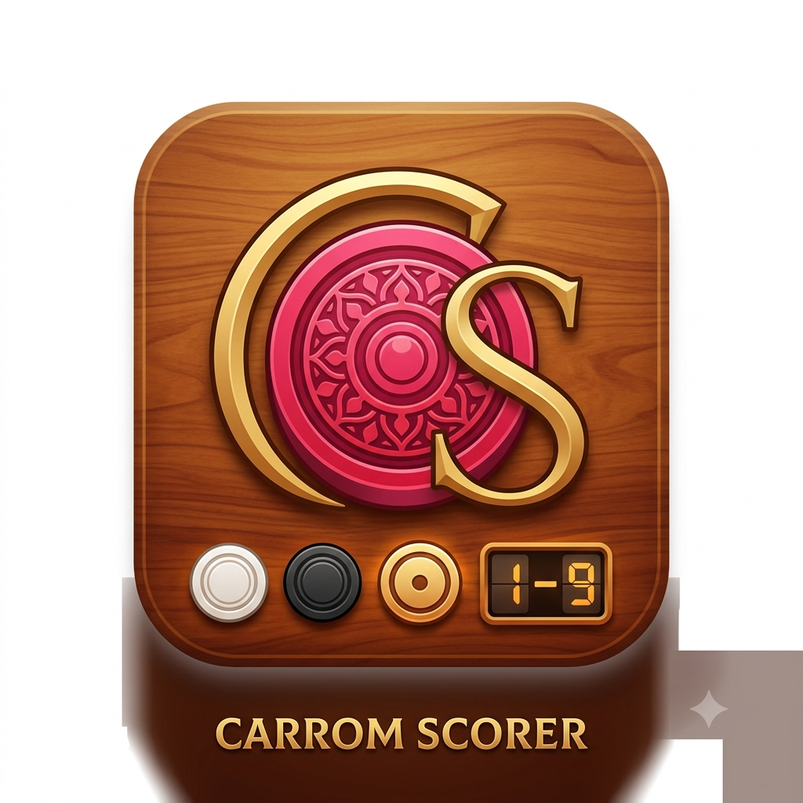

# Carrom Match Assistant & Scorer

A modern, offline-first mobile app for tracking and scoring Carrom matches according to **International Carrom Federation (ICF)** rules. Built with **Expo + React Native**, it works on iOS, Android and web with the same codebase.

<p align="center">
  
</p>

## ✨ Features

- **Singles (1v1) and Doubles (2v2)** match support with 4 individual player names in doubles
- **ICF-compliant scoring** — 1 point per opponent piece remaining, +3 Queen bonus (only if winner is under 22 and had already pocketed one own coin)
- **Strict Queen Rule toggle** for referees who want to enforce eligibility
- **Configurable series** — Best of 1 / 3 / 5, and 8 boards per set OR unlimited (first to 25)
- **Interactive board graphic** showing live seat placements and the ⚡ break indicator
- **Automatic seat rotation** — Singles swap N↔S after each set, Doubles rotate 90° clockwise
- **Board history & dues tracking** with real-time increment/decrement
- **Tie-break board** when the score is level after the final board of a set
- **Light and Dark themes** with warm-wood accents and amber highlights
- **Offline-first persistence** — active matches are cached with AsyncStorage; no login, no server
- **Sound + haptic feedback** — soft chime and success haptic when a board is completed
- **Adaptive layouts** for phone portrait, landscape and larger screens
- **ICF Rules reference sheet** with a link to the official federation site

## 🧱 Tech Stack

| Layer | Choice |
|---|---|
| Framework | Expo SDK 54 + React Native 0.81 |
| Routing | expo-router (file-based) |
| Language | TypeScript |
| Icons | @expo/vector-icons (Material Community) |
| Local storage | @react-native-async-storage/async-storage |
| Audio | expo-audio |
| Haptics | expo-haptics |
| Deep links | expo-linking |

## 🚀 Getting Started

Prerequisites: Node 20+, Yarn 1.22.

```bash
cd frontend
yarn install
yarn start          # start the Metro bundler
yarn android        # run on an Android emulator / device
yarn ios            # run on an iOS simulator (macOS only)
yarn web            # run in a browser
```

Scan the QR code from the Metro terminal with the **Expo Go** app to preview the build on a physical device.

## 📁 Project Structure

```
app/
├── frontend/               # Expo React Native app (the whole product)
│   ├── app/                # expo-router screens
│   │   ├── _layout.tsx     # root layout, safe-area, icon prewarm
│   │   └── index.tsx       # main app (setup → toss → active match)
│   ├── assets/             # icons, splash, chime.wav
│   ├── src/utils/          # helpers (async storage, etc.)
│   ├── app.json            # Expo configuration
│   └── package.json
├── backend/                # (unused starter — no server calls in this build)
├── memory/                 # product docs (PRD.md)
├── AGENTS.md               # contributor / AI-agent guide
└── README.md
```

## 🎯 ICF Rules Implemented

- Match target: first team to 25 points OR highest score after 8 boards
- Board points: number of opponent coins left (1–9) when the board ends
- Queen bonus: +3 to the board winner if they were under 22 before scoring AND had already pocketed at least one of their own coins
- Doubles seating: partners sit opposite each other (N↔S, E↔W)
- Rotation policy: seats rotate only when a full set ends (configurable)
- Tie handling: if the score is level after the final board, a deciding tie-break board is played

## 🗒️ License

MIT — free to use, adapt and share.

## 🙏 Acknowledgements

Rules & format based on the [International Carrom Federation](https://www.internationalcarromfederation.com/).
